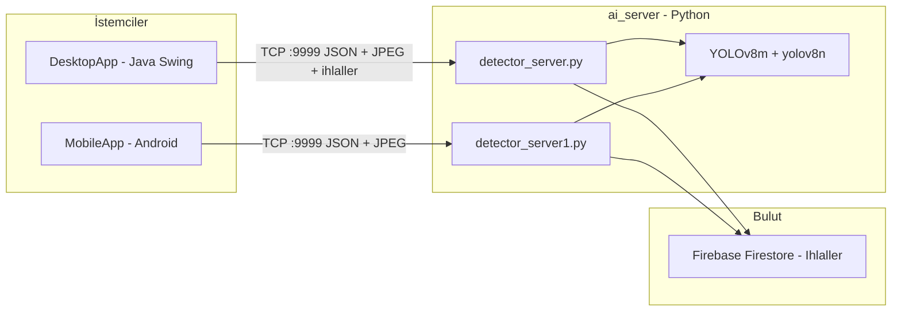

# Yapay Zeka Tabanlı İş Sağlığı ve Güvenliği (İSG) Kontrol Sistemi

[English Version](#english-version)


---

## Özet

Bu proje, **100+ personel** ölçeğindeki endüstriyel tesislerde Kişisel Koruyucu Donanım (KKD) uyumunu gerçek zamanlı izlemek için geliştirilmiş, yapay zeka destekli bir **İş Sağlığı ve Güvenliği (İSG)** kontrol sistemidir. Sistem, **6331 sayılı İş Sağlığı ve Güvenliği Kanunu** kapsamındaki yükümlülükleri destekleyecek şekilde tasarlanmış olup **10 farklı KKD sınıfını** (maske, baret, yelek, gözlük, emniyet kemeri, koruyucu elbise, eldiven, alet çantası, kaynak maskesi, kulak koruyucu) tespit edebilmektedir.

---

## Mimari

Sistem dağıtık bir mimari üzerine kuruludur:



| Bileşen | Konum | Görev |
|---------|-------|-------|
| **AI Sunucusu (Masaüstü)** | `ai_server/detector_server.py` | Webcam + YOLO çıkarımı, Java istemcisine görüntü ve ihlal listesi gönderimi |
| **AI Sunucusu (Mobil)** | `ai_server/detector_server1.py` | Android istemcisine görüntü akışı, Firebase ihlal kaydı |
| **Masaüstü İstemci** | `DesktopApp/SafetyApp.java` | Swing arayüzü, KKD kural seçimi, canlı uyarı paneli |
| **Android İstemci** | `MobileApp/MobileApp/ISG_2/` | Mobil KKD kontrol arayüzü, TCP soket istemcisi |

**İletişim protokolü:** Java/Android istemcileri, Python sunucusuna TCP soket üzerinden (port **9999**) JSON formatında KKD kurallarını gönderir. Sunucu, YOLOv8m ile çıkarım yapar ve uzunluk önekli binary protokolle (`4 byte big-endian length + payload`) JPEG görüntüsünü geri iletir. Masaüstü sunucusu ek olarak ihlal metinlerini de iletir. Firebase Firestore'a ihlal kayıtları **asenkron thread** ile yazılır (`Ihlaller` koleksiyonu).

---

## Yapay Zeka Metrikleri

| Metrik | Değer |
|--------|-------|
| Model | YOLOv8m (10 sınıflı KKD) |
| mAP@0.5 | **0.969** |
| mAP@0.5:0.95 | **0.833** |
| Çıkarım gecikmesi | **1.5 ms** (@ 640px) |
| Yardımcı model | yolov8n.pt (person detection) |

---

## Proje Yapısı

```
ISG_Kontrol_Sistemi/
├── ai_server/                  # Python AI sunucusu (YOLO + TCP + Firebase)
│   ├── detector_server.py      # Masaüstü istemci sunucusu
│   ├── detector_server1.py     # Android istemci sunucusu
│   ├── isg_canli_test.py       # Bağımsız webcam test scripti
│   ├── .env.example            # Ortam değişkenleri şablonu
│   ├── firebase-adminsdk.example.json
│   └── requirements.txt
├── DesktopApp/                 # Java Swing masaüstü istemci
│   ├── SafetyApp.java
│   └── config.properties.example
└── MobileApp/
    └── MobileApp/
        └── ISG_2/              # Android Gradle projesi
```

---

## Kurulum

### 1. Depoyu klonlayın

```bash
git clone https://github.com/ozgezaraozcelik/Yapay_Zeka_Destekli_ISG_Kontrol_Sistemi.git
cd Yapay_Zeka_Destekli_ISG_Kontrol_Sistemi
```

### 2. Python AI sunucusunu hazırlayın

```bash
cd ai_server
python -m venv venv
venv\Scripts\activate        # Windows
pip install -r requirements.txt
```

### 3. Yapılandırma dosyalarını oluşturun

```bash
copy .env.example .env
copy firebase-adminsdk.example.json firebase-adminsdk.json
```

- `firebase-adminsdk.json` dosyasını [Firebase Console](https://console.firebase.google.com/) → Proje Ayarları → Hizmet Hesapları → Yeni özel anahtar oluştur ile indirdiğiniz gerçek JSON ile doldurun.
- `.env` dosyasında `HOST`, `PORT` ve model yollarını gerektiğinde düzenleyin.

### 4. YOLO model ağırlıklarını yerleştirin

`ai_server/` klasörüne aşağıdaki dosyaları ekleyin (Git'e dahil edilmez):

- `best.pt` — eğitilmiş 10 sınıflı KKD modeli
- `yolov8n.pt` — person detection modeli (Ultralytics'ten indirilebilir)

### 5. Sunucuyu başlatın

**Masaüstü istemci için:**
```bash
python detector_server.py
```

**Android istemci için:**
```bash
python detector_server1.py
```

### 6. Masaüstü istemciyi çalıştırın

```bash
cd DesktopApp
javac SafetyApp.java
java SafetyApp
```

### 7. Android istemciyi çalıştırın

1. `MobileApp/MobileApp/ISG_2/` klasörünü Android Studio'da açın.
2. Emülatör için sunucu IP'si varsayılan olarak `10.0.2.2` (host loopback) kullanılır.
3. Fiziksel cihaz için `MainActivity.java` içindeki `SERVER_IP` değerini bilgisayarınızın yerel ağ IP'si ile güncelleyin.

---

## Güvenlik Notları

- **Asla** gerçek `firebase-adminsdk.json` veya `.env` dosyalarını Git'e eklemeyin.
- Firebase Admin SDK anahtarları yalnızca sunucu tarafında kullanılır; Android istemcisi Firebase SDK içermez.
- Eski anahtarlar herkese açık bir repoda paylaşıldıysa Google Cloud Console üzerinden **hemen iptal edin** ve yeni anahtar oluşturun.

---

## Lisans

Bu proje Özge Zara Özcelik tarafından bitirme tezi kapsamında geliştirilmiştir.

---

<a id="english-version"></a>

# AI-Based Occupational Health and Safety (OHS) Control System


---

## Abstract

This project is an AI-powered **Occupational Health and Safety (OHS)** control system designed to monitor Personal Protective Equipment (PPE) compliance in real time at industrial facilities with **100+ personnel**. Built to support obligations under **Turkish OHS Law No. 6331**, the system detects **10 PPE classes**: mask, helmet, vest, goggles, safety belt, protective suit, gloves, toolbox, welding helmet, and ear protection.

---

## Architecture

The system follows a distributed architecture:


| Component | Path | Role |
|-----------|------|------|
| **AI Server (Desktop)** | `ai_server/detector_server.py` | Webcam + YOLO inference, sends image and violation list to Java client |
| **AI Server (Mobile)** | `ai_server/detector_server1.py` | Image stream to Android client, Firebase violation logging |
| **Desktop Client** | `DesktopApp/SafetyApp.java` | Swing UI, PPE rule selection, live alert panel |
| **Android Client** | `MobileApp/MobileApp/ISG_2/` | Mobile PPE control UI, TCP socket client |

**Communication protocol:** Java/Android clients send PPE rules as JSON over TCP (port **9999**). The server runs YOLOv8m inference and returns JPEG images via a length-prefixed binary protocol (`4-byte big-endian length + payload`). The desktop server also sends violation text. Violation records are written to Firebase Firestore **asynchronously via threads** (`Ihlaller` collection).

---

## AI Metrics

| Metric | Value |
|--------|-------|
| Model | YOLOv8m (10-class PPE) |
| mAP@0.5 | **0.969** |
| mAP@0.5:0.95 | **0.833** |
| Inference latency | **1.5 ms** (@ 640px) |
| Auxiliary model | yolov8n.pt (person detection) |

---

## Project Structure

```
ISG_Kontrol_Sistemi/
├── ai_server/                  # Python AI server (YOLO + TCP + Firebase)
│   ├── detector_server.py      # Desktop client server
│   ├── detector_server1.py     # Android client server
│   ├── isg_canli_test.py       # Standalone webcam test script
│   ├── .env.example            # Environment variable template
│   ├── firebase-adminsdk.example.json
│   └── requirements.txt
├── DesktopApp/                 # Java Swing desktop client
│   ├── SafetyApp.java
│   └── config.properties.example
└── MobileApp/
    └── MobileApp/
        └── ISG_2/              # Android Gradle project
```

---

## Installation

### 1. Clone the repository

```bash
git clone https://github.com/ozgezaraozcelik/Yapay_Zeka_Destekli_ISG_Kontrol_Sistemi.git
cd Yapay_Zeka_Destekli_ISG_Kontrol_Sistemi
```

### 2. Set up the Python AI server

```bash
cd ai_server
python -m venv venv
venv\Scripts\activate        # Windows
pip install -r requirements.txt
```

### 3. Create configuration files

```bash
copy .env.example .env
copy firebase-adminsdk.example.json firebase-adminsdk.json
```

- Fill `firebase-adminsdk.json` with the real JSON downloaded from [Firebase Console](https://console.firebase.google.com/) → Project Settings → Service Accounts → Generate new private key.
- Adjust `HOST`, `PORT`, and model paths in `.env` as needed.

### 4. Place YOLO model weights

Add the following files to `ai_server/` (not tracked in Git):

- `best.pt` — trained 10-class PPE model
- `yolov8n.pt` — person detection model (downloadable from Ultralytics)

### 5. Start the server

**For desktop client:**
```bash
python detector_server.py
```

**For Android client:**
```bash
python detector_server1.py
```

### 6. Run the desktop client

```bash
cd DesktopApp
javac SafetyApp.java
java SafetyApp
```

### 7. Run the Android client

1. Open `MobileApp/MobileApp/ISG_2/` in Android Studio.
2. For emulator, the default server IP is `10.0.2.2` (host loopback).
3. For a physical device, update `SERVER_IP` in `MainActivity.java` with your PC's local network IP.

---

## Security Notes

- **Never** commit real `firebase-adminsdk.json` or `.env` files to Git.
- Firebase Admin SDK keys are used server-side only; the Android client does not include the Firebase SDK.
- If old keys were ever exposed in a public repository, **revoke them immediately** in Google Cloud Console and generate new ones.

---

## License

This project was developed by Özge Zara Özcelik as part of a graduation thesis.
